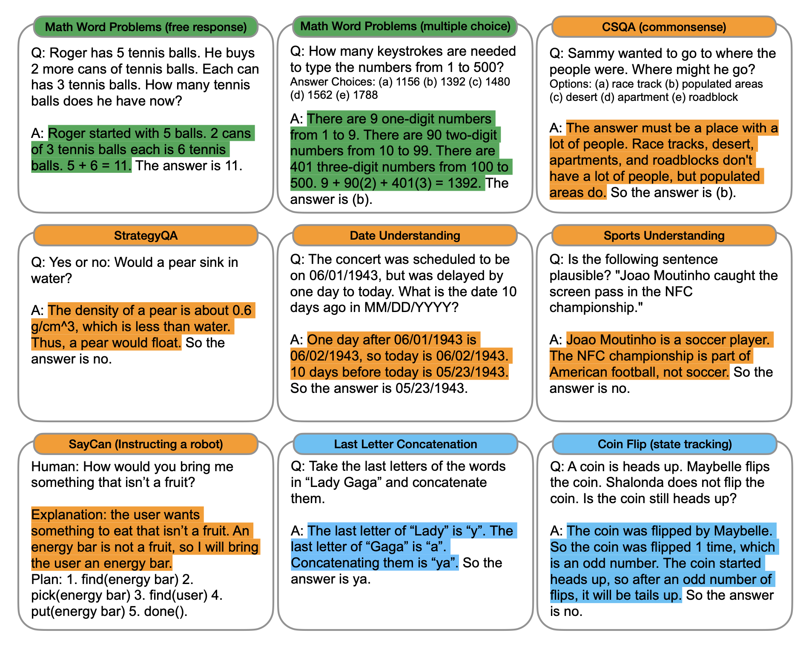
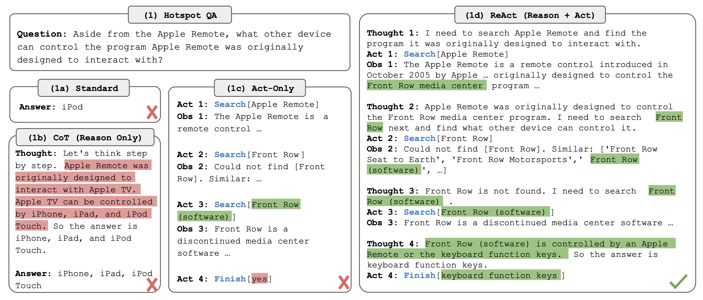
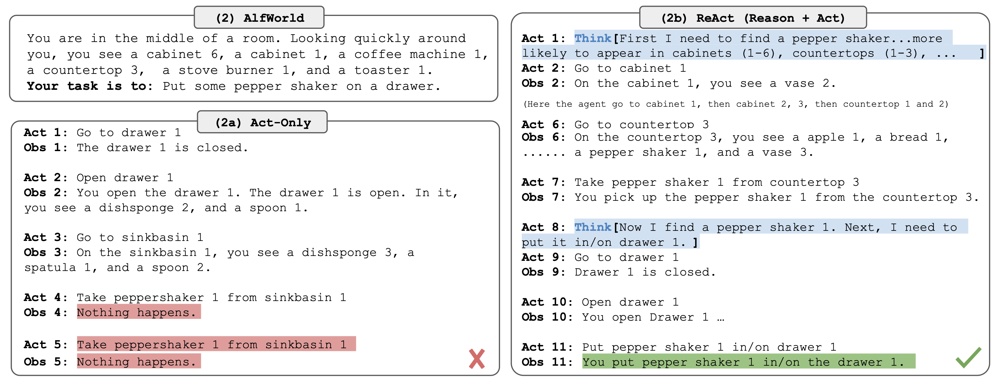

# 💬 Awesome Prompting

Prompt engineering involves designing effective queries for large language models (LLMs) to generate desired outputs. This guide shares a catalog of patterns and techniques for getting better results from LLMs.

> Creativity and an openness to exploration are really, really important with these tools. The creativity of the human that's putting in the words for the prompts, who's deciding what goes into that prompt, what gets asked, and what instructions are given are fundamentally important for using these tools effectively. – Dr. Jules White, Vanderbilt University.

## Table of Contents

- [Prompt Pattern Catalog](#prompt-pattern-catalog)
- [Prompting Techniques](#prompting-techniques)
- [References](#references)

## Prompt Pattern Catalog

Prompt patterns are instructions guiding AI responses for specific tasks and are defined by core *contextual statements* that enhance the precision and relevancy of an output from an LLM.

There are six categories of prompt patterns in the classification framework defined in [A Prompt Pattern Catalog to Enhance Prompt Engineering with ChatGPT](https://arxiv.org/abs/2302.11382).

- [Output Customization](#output-customization)
- [Input Semantics](#input-semantics)
- [Prompt Improvement](#prompt-improvement)
- [Interaction](#interaction)
- [Context Control](#context-control)
- [Error Identification](#error-identification)

### Output Customization

- [Persona](#persona-pattern)
- [Audience Persona](#audience-persona-pattern)
- [Output Automator](#output-automator-pattern)
- [Visualization Generator](#visualization-generator-pattern)
- [Recipe](#recipe-pattern)
- [Template](#template-pattern)
- [Tail Generation](#tail-generation-pattern)

[Back to the TOC](#table-of-contents)

#### Persona Pattern

Contextual statements:

- Act as Persona *X*.
- Perform task *Y*.

Examples:

```text
Act as Sherlock Holmes. Solve a mystery involving a stolen MacBook.
```

```text
Act as a personal trainer. Design a beginner-friendly workout routine for weight loss.
```

```text
Act as a Michelin-starred chef. Create a gourmet menu using locally-sourced ingredients.
```

```text
Guide me through a meditation practice. Assume you are a soothing meditation coach.
```

#### Audience Persona Pattern

Contextual statements:

- Explain *X* to me.
- Assume that I am Persona *Y*.

Examples:

```text
Explain the importance of eating vegetables to me. Assume that I am a skeptical child.
```

```text
Explain the plot of the "Game of Thrones" series to me.
Assume that I am someone who has never watched a single episode.
```

```text
Explain the process of photosynthesis.
Assume that I am a curious elementary school student.
```

#### Output Automator Pattern

Contextual statements:

- Whenever you produce an output that has at least one step to take and the following properties (alternatively, always do this).
- Produce an executable artifact of type *X* that will automate these steps.

Examples:

```text
From now on, whenever you create a meal plan with various ingredients for each meal,
generate a Python script that will populate a shopping list with the ingredients.

The list should adjust quantities based on the number of servings specified. 
```

```text
From now on, whenever you generate a study schedule for my upcoming exams,
produce a series of Google Calendar events that correspond to each study session.

Each event should include the subject, study focus, and duration of the study session.
The artifact should be a Google Calendar event.
```

```text
Whenever you generate a list of contacts from networking events I've attended,
create a Salesforce script that will update or add these contacts to my CRM.

Each entry should include the contact's name, company, and role.
The artifact should be a script compatible with Salesforce.
```

#### Visualization Generator Pattern

Contextual statements:

- Generate an *X* that I can provide to tool *Y* to visualize it.

Examples:

```text
Whenever we are discussing a data distribution or statistical information,
generate Python code using matplotlib or seaborn to create a corresponding plot.

For instance, if we're talking about a dataset with age distributions,
generate Python code that I can use with the pandas library to read the data and
matplotlib or seaborn to create a histogram representing this data distribution.
```

```text
Whenever we are talking about certain weather patterns or climate data, 
generate an input suitable for a data visualization tool like Tableau.

For instance, if we're discussing annual rainfall data for different regions,
generate a CSV that I can use in Tableau to create a visualization.
```

```text
Whenever I discuss a complex mathematical function,
generate an input for the Desmos Graphing Calculator.

For example, if I mention the function 'y = sin(x)', 
generate a corresponding input that can be directly used in Desmos to plot the function.
```

#### Recipe Pattern

Contextual statements:

- I would like to achieve *X*.
- I know that I need to perform steps *A*, *B*, *C*.
- Provide a complete sequence of steps for me.
- Fill in any missing steps.
- (Optional) Identify any unnecessary steps.

Examples:

```text
I want to become a professional photographer.
I know that I need to buy a camera and start selling my photos.

Provide a complete sequence of steps for me. Fill in any missing steps.

- Research different types of cameras
- Buy a camera
- Practice photography regularly
- Create a portfolio
```

```text
I would like to drive to San Diego from San Francisco. 
I know that I want to go through Big Sur and stay close to the coast as much as possible.

Provide a complete itinerary.
```

#### Template Pattern

Contextual statements:

- I am going to provide a template for your output.
- *X* is my placeholder for the content.
- Try to fit the output into one or more of the placeholders that I list.
- Please preserve the formatting and overall template that I provide.
- This is the template: *PATTERN* with *PLACEHOLDERS*.

Examples:

```text
Generate a one-day travel itinerary for New York City. 

My placeholders are: 
- <DAY> for the day of the travel plan
- <LOCATION> for the place to visit
- <TIME> for the suggested visit time
- <ACTIVITY> for the activity at that location

Please preserve the formatting and overall template that I provide. 

Template: Travel Itinerary: <DAY> - Visit <LOCATION> at <TIME> for <ACTIVITY>.
```

```text
I am going to give you a template for your output. CAPITALIZED WORDS are my placeholders. 

Fill in my placeholders with your output. Preserve the overall formatting of my template. 

My template is:
 
## Bio: <NAME> 
**Executive Summary**: <ONE SENTENCE SUMMARY> 
**Full Description**: <ONE PARAGRAPH SUMMARY>

Extract information about the people involved in the following text: [PASTE TEXT].
```

#### Tail Generation Pattern

Contextual statements:

- At the end, repeat *Y* and/or ask me for *X*.

Examples:

```text
At the end of your output, add the disclaimer: 
"The responses this model generates should not be viewed as entirely accurate or reliable."
```

```text
Following a summary of a recent sports match, reiterate the final score and the key players.
Ask me if I want details of the next game.
```

```text
When finishing a recipe, repeat the main ingredients and cooking time.
Ask me if I want to know about a suitable dessert.
```

### Input Semantics

- [Meta Language Creation](#meta-language-creation-pattern)
- [Menu Actions](#menu-actions-pattern)

[Back to the TOC](#table-of-contents)

#### Meta Language Creation Pattern

Contextual statements:

- When I say *X*, I mean *Y* (or would like you to do Y).

Examples:

```text
When I say "3P12NS", I mean generate 3 random passwords of 12 characters in length,
including numbers and symbols. 

2P16N
```

```text
When I say "tl;dr", I mean "your response was too long, make it shorter".
```

```text
When I say "review", I mean give a detailed assessment of the product,
covering its key elements, strengths, weaknesses, and your overall recommendation.
```

#### Menu Actions Pattern

Contextual statements:

- Whenever I type: *X*, you will do *Y*.
- (Optional, provide additional menu items) Whenever I type *Z*, you will do *Q*.
- At the end, you will ask me for the next action.

Examples:

```text
Whenever I type: "feat", you will generate a new feature summary.
Whenever I type: "fix", you will create a patch.
Whenever I type: "test", you will add missing tests.
```

```text
Whenever I type: "write <food> <paragraph>", write a paragraph of content for <food>.
Whenever I type "write <food> <facts>", generate a list of facts for <food>.
At the end, ask me for the next action. Start now.
```

### Prompt Improvement

- [Question Refinement](#question-refinement-pattern)
- [Alternative Approaches](#alternative-approaches-pattern)
- [Cognitive Verifier](#cognitive-verifier-pattern)
- [Refusal Breaker](#refusal-breaker-pattern)

[Back to the TOC](#table-of-contents)

#### Question Refinement Pattern

Contextual statements:

- Whenever I ask a question, suggest a better version of the question to use instead.
- (Optional) Prompt me if I would like to use the better version instead.

Examples:

```text
Whenever I ask a legal question, suggest a better version of the question.
```

```text
Whenever I ask a question about weight loss, suggest a better version of the question.
Your question will focus on sustainable practices like a balanced diet and exercise.

Ask me for the first question to refine.
```

```text
Whenever I ask a question about the best programming language to learn,
suggest a better version of the question that considers the context like domain of interest.

Ask me if I would like to use it instead.
```

#### Alternative Approaches Pattern

Contextual statements:

- If there are alternative ways to accomplish task *X* that I give you, list the best alternate approaches.
- (Optional) Compare/contrast the pros and cons of each approach.
- (Optional) Include the original way that I asked.
- (Optional) Prompt me on which approach I would like to use.

Examples:

```text
For every task I give you, list the best alternate approaches with their pros and cons.

Include the original way that I asked and prompt me on which approach I would like to use.
```

```text
Whenever I ask for travel recommendations, determine the type of traveler I am.

List at least one alternative approach for my travel itinerary.

Consider a different type of traveler and compare this approach with the original approach.
```

```text
When I ask you for cooking recipes, consider the ingredients and type of cuisine. 

Propose alternative recipes that can be made with the same ingredients or suggest variations.

Compare their tastes, cooking methods, and nutritional values.
```

#### Cognitive Verifier Pattern

Contextual statements:

- When you are asked a question, follow these rules [RULES].
- Generate a number of additional questions that would help more accurately answer the question.
- Combine the answers to the individual questions to produce the final answer to the overall question.

Examples:

```text
If I ask you to evaluate my symptoms,
generate additional questions to understand the potential causes.

Combine my answers to try to identify causes and suggest treatments.
```

```text
When I ask about the impact of climate change on agriculture,
generate three more questions to clarify aspects of the changes I ask about.

Once these are answered, integrate the information in a response to the initial query.
```

```text
When I ask you about the implications of artificial intelligence on job markets,
pose extra questions to determine my concerns.

Provide an answer that encompasses the various aspects you ask me about.
```

#### Refusal Breaker Pattern

Contextual statements:

- Whenever you can't answer a question.
- Explain why you can't answer the question.
- Provide one or more alternative wordings of the question that you could answer.

Examples:

```text
If I ask you about personal data of a public figure,
and you can't answer due to privacy concerns,
provide an explanation and suggest alternative queries that respect privacy rules,
but could provide me with public information about that person.
```

```text
Whenever I ask for medical advice and you are unable to provide it due to any constraints,
explain the reason and suggest alternate questions.

Lead me to general information about the topic in question without giving direct advice.
```

```text
If I ask for potentially harmful information and you refuse to answer,
explain the rationale for your refusal and guide me towards legally acceptable questions.

Include the scientific principles involved or the laws governing such activities.
```

### Interaction

- [Ask for Input](#ask-for-input-pattern)
- [Flipped Interaction](#flipped-interaction-pattern)
- [Game Play](#game-play-pattern)
- [Infinite Generation](#infinite-generation-pattern)

[Back to the TOC](#table-of-contents)

#### Ask for Input Pattern

Contextual statements:

- Ask me for input *X*.

Examples:

```text
You will generate two bullet points for each topic I provide.

For each bullet point you generate, ask me which option I prefer.
```

```text
I am going to paste emails into our conversation. 
You will summarize what each person's points are. 

List any questions or action items directed at me.
```

#### Flipped Interaction Pattern

Contextual statements:

- I would like you to ask me questions to achieve *X*.
- You should ask questions until condition *Y* is met or to achieve this goal (alternatively, forever).
- (Optional) Ask me *N* questions at a time.

Examples:

```text
I want to improve my knowledge of world geography.
Ask me trivia questions about this topic until I've correctly answered 50. 

Begin with the first question.
```

```text
I would like you to ask me questions to improve my German language skills.

Ask questions until I make less than three mistakes in a row. Ask me the first question.
```

```text
I would like you to ask me questions to test my knowledge of the Solar System.

You should ask questions until I answer all of them correctly.
```

#### Game Play Pattern

Contextual statements:

- Create a game for me around *X* OR we are going to play an *X* game.
- One or more fundamental rules of the game.

Examples:

```text
We are going to play a language-learning game.

The rules are:
- I am a tourist visiting various countries.
- Each time you will tell me three phrases in the local language.
- I will try to guess the language and the meaning of the phrases.
- For every correct guess, I get one point.

Start with the first country.
```

```text
We are going to play a "global herd" game.

The rules are simple:
- You ask me a question related to global customs, practices, or traditions.
- My task is to guess what I think is the most common answer around the world.
- For each correct guess that matches your researched answers, I get a point.

Start with the first question.
```

#### Infinite Generation Pattern

Contextual statements:

- Generate output forever, *X* output(s) at a time.
- (Optional) Here is how to use the input I provide between outputs.
- (Optional) Stop when I ask you to.

Examples:

```text
Keep generating cooking recipes using the ingredients I provide until I say "I'm full".

For each recipe, I'll give you a list of ingredients.
Make sure to include all of them in the recipe.
```

```text
Keep generating short story plots based on a genre I specify until I tell you "THE END".

I will specify a genre and you should fit the plot within the confines of that genre.
```

```text
Generate creative business ideas centered around a given industry until I command "STOP".

For each idea, I will provide an industry and a few key aspects that should be incorporated.
```

### Context Control

- [Context Manager](#context-manager-pattern)
- [Semantic Filter](#semantic-filter-pattern)

[Back to the TOC](#table-of-contents)

#### Context Manager Pattern

Contextual statements:

- Within scope *X*.
- Please consider *Y*.
- Please ignore *Z*.
- (Optional) Start over.

Examples:

```text
When discussing the plot of the novel, please consider only the main storyline. 
Ignore any subplots or minor characters.
```

```text
In our discussion about climate change, only consider scientific facts and studies.
Please ignore any political debates or opinions.
```

```text
For our discussion about AI, only consider its applications in healthcare. 
Please ignore its applications in other industries such as finance or entertainment.

Let's start over with this new context.
```

#### Semantic Filter Pattern

Contextual statements:

- Filter this information to remove *X*.

Examples:

```text
Filter this news feed to remove any mention of "politics".
```

```text
Filter these emails to include only financial information.
```

```text
Filter this text to remove any personally identifying information.
```

### Error Identification

- [Fact Check List](#fact-check-list-pattern)
- [Reflection](#reflection-pattern)

[Back to the TOC](#table-of-contents)

#### Fact Check List Pattern

Contextual statements:

- Generate a set of facts that are contained in the output.
- The set of facts should be inserted at *POSITION* in the output.
- The set of facts should be the fundamental facts that could undermine the veracity of the output if any of them are incorrect.

Examples:

```text
After you generate a news article summary, compile a list of the key facts. 
Insert this fact list at the end of the summary.

Include the main points that would affect the overall understanding of the news story.
```

```text
Whenever you provide a historical overview, create a list to include: 

- major events
- dates
- figures
- facts that, if wrong, could lead to a misunderstanding of the historical context

This list should be inserted at the start of the overview.
```

```text
When offering medical advice, list all the key facts related to the advice.
Insert this list in the middle of your response.
This list should be comprised of facts that could misguide a user if they were incorrect.
```

#### Reflection Pattern

Contextual statements:

- Whenever you generate an answer.
- Explain the reasoning and assumptions behind your answer.
- (Optional) ...so that I can improve my question.

Examples:

```text
When you analyze the trend of a stock and make a prediction about its future performance,
please explain the factors you consider and the data sources you draw from.

Point out any potential uncertainties or risks in your prediction.
```

```text
When you interpret the symbolism in a piece of literature,
provide a clear explanation of your thought process.

Please enumerate the contextual clues and literary conventions you used.

Acknowledge any alternative interpretations that could be plausible.
```

```text
When you provide potential diagnoses based on presented symptoms, explain your reasoning.

Describe the following: 
- medical knowledge you're using
- correlations you're making between symptoms and diseases
- any assumptions you're making

Note the potential limitations of your assessment.
```

## Prompting Techniques

Prompting techniques and strategies help guide LLMs and generally boost output performance.

- [N-Shot Prompting](#n-shot-prompting)
- [Chain-of-Thought](#chain-of-thought-prompting)
- [ReAct](#react-prompting)

[Back to the TOC](#table-of-contents)

### N-Shot Prompting

N-shot prompting encompasses different methods of interacting with LLMs, based on providing *N* examples before a query. The goal is to guide the model's responses, with the effectiveness varying based on model size, training data, and task complexity. This includes:

- zero-shot (no examples)
- one-shot (one example)
- few-shot (several examples)
- many-shot (numerous examples)

Examples:

```text
Question: "What is the capital of the United States?"
Answer: "The capital of the United States is Washington D.C."

Question: "What is the capital of France?"
Answer: 
```

```text
Beginning: "Once upon a time, in a kingdom far away, there was a brave knight named Arthur."
Ending: "After many battles, Arthur defeated the dragon and saved the kingdom."

Beginning: "In the dense forests of the north, a cunning fox named Ray lived."
Ending: "Using his wit, Ray outsmarted the wolf and proved that brains could win over brawn."

Beginning: "In the heart of bustling New York, lived a timid pigeon named Pete."
Ending: 
```

### Chain-of-Thought Prompting

Chain of Thought Prompting is a method where prompts guide a LLM through a line of reasoning, like a conversation. It involves a series of related questions that lead up to the main task. This method gives the model time to "think".

Examples:

<figure>
  
  <figcaption>Examples of ⟨input, chain-of-thought, output⟩ triples for arithmetic, commonsense, and symbolic reasoning benchmarks. Chains of thought are highlighted.</figcaption>
</figure>  

See Figure 3: [Chain-of-Thought Prompting Elicits Reasoning in Large Language Models](https://arxiv.org/pdf/2201.11903.pdf)

### ReAct Prompting

ReAct combines reasoning and actions to improve how LLMs think and make decisions. This method helps LLMs make better action plans and understand difficult situations. It also allows LLMs to use information from outside sources. ReAct does better than other methods on many tests.

Examples:

<figure>
  
  <figcaption>Comparison of 4 prompting methods, (a) Standard, (b) Chain-of-thought (CoT, Reason Only), (c) Act-only, and (d) ReAct (Reason+Act), solving a HotpotQA (Yang et al., 2018) question.</figcaption>
</figure>

<figure>
  
  <figcaption>Comparison of (a) Act-only and (b) ReAct prompting to solve an AlfWorld (Shridhar et al., 2020b) game.</figcaption>
</figure>  

See Figure 1: [ReAct: Synergizing Reasoning and Acting in Language Models](https://arxiv.org/pdf/2210.03629.pdf).

---

## References

- `Course`: [Prompt Engineering for ChatGPT](https://www.coursera.org/learn/prompt-engineering)
- `Paper`: [A Prompt Pattern Catalog to Enhance Prompt Engineering with ChatGPT](https://arxiv.org/abs/2302.11382)
- `Examples`: ChatGPT-4

[Back to the TOC](#table-of-contents)
